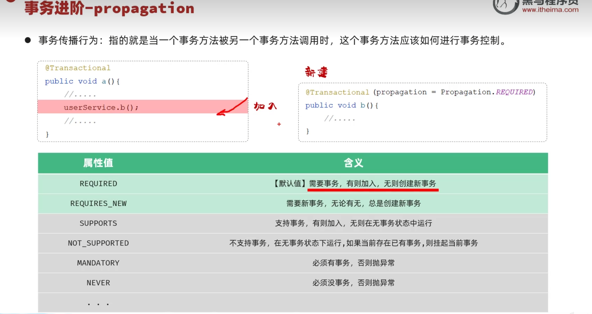
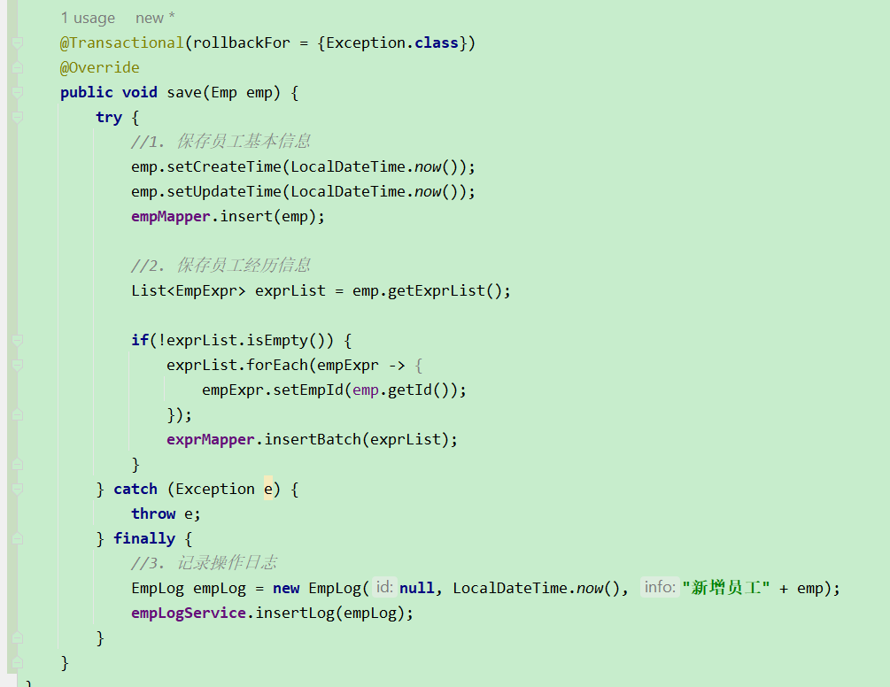
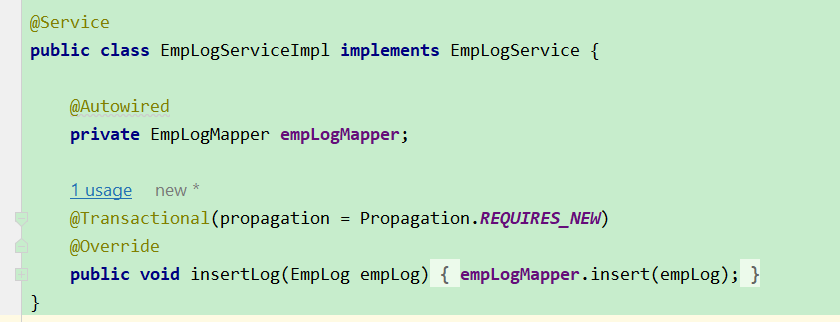
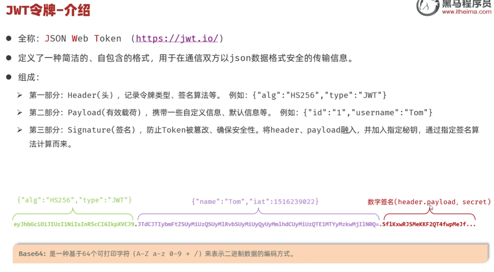
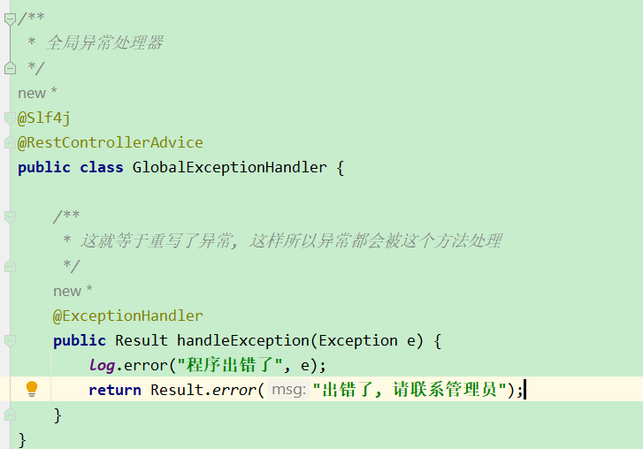

# Tlias-Web-Management

# 分页查询
- 使用了PageHelper分页插件 来实现了分页, 并且通过自定义PageResult来封装分页的数据, 然后返回给前端
- 原始的分页查询实现 需要传参start 和 pageSize, 并且需要把这两个参数放到query语句里面
- 通过PageHelper不需要将这两个参数手动放入到query语句里面, 但是前端还是需要穿start和pageSize

# 为什么使用PageHelper
- 他会自动帮我们生成两条两条sql 语句
    - 一个是count
        - 查找总数
    - 一个是帮我们自动会帮我们拼接limit来进行分页
- 复习PageHelper, 查看 EmpController -> EmpService -? EmpMapper

# 事务的传播行为
- 

### REQUIRES_NEW例子:
- 如果现在有一个需求, 就是在新增员工信息的时候, 无论成功还是失败, 我们都要记录操作日志
- 那么如果用下面这个方法, 它会先执行, 然后如果报错了 再回滚, 那么这种情况下 finally里面的数据也会被回滚
- 
- 所以解决的办法就是, 这个Log应该单独开一个事务, 这样及时新增员工失败了, 也可以记录. 所以需要在日志上添加传播行为
- 

# 什么是跨域
- 跨域分三个维度: 协议, IP/域名, 端口
  - 这三个任意一个不同就是跨域了

# Cookie:
- 定义:
  - 存储在客户端浏览器上的文本文件
- 存储位置:
  - 浏览器(本地磁盘或内存)
- 原理
  - 服务端通过 HTTP 响应头 Set-Cookie 把 Cookie 发送给客户端；
  - 客户端保存该 Cookie，并在后续请求中通过 Cookie 请求头发送回服务端；
  - 服务端读取 Cookie 实现识别身份或状态维持。
- 优点:
  - HTTP协议中支持的技术, 即可以自动的将cookie设置在请求头/响应头里面
- 缺点:
  - 移动端不能够使用Cookie
  - 不安全, 用户可以自己禁用Cookie
  - Cookie不能跨域

# Session:
- 定义:
  - 存储在服务器端的数据结构
- 存储位置:
  - Web服务器内存中
- 原理:
  - 第一次访问时, 服务端创建一个Session对象, 并且生成唯一的SessionID
  - 服务端通过Set-Cookie把SessionID写入客户端Cookie;
  - 以后客户端每次访问会自动带上 SessionID
  - 服务端通过 SessionID 查找对应的 Session 数据，实现身份识别和状态维持
- 优点
  - 只有SessionID是暴露在浏览器里面, 具体数据不会暴露出来
  - 具体数据存在服务端, 安全
- 缺点
  - 所以Cookie的缺点, 因为它底层其实就是Cookie

# JWT (重点, 现在开发都使用这个, 而不是用Session或者Cookie)
- 原理:
  - 登入成功之后,会创建一个 token, 然后返回给客户端, 然后客户端就需要把这个token存起来,
  - 然后每一次发起请求, 客户端都应该携带这个token, 如果token合法 就返回数据, 如果不合法, 则响应错误结果
- 优点:
  - 支持PC端移动端
  - 解决集群环境下的认证问题
  - 减轻服务器存储压力
- 缺点
  - 需要程序员自己实现
- 
- JWT有三个部分组成
  - Header
    - 请求头
  - payload
    - 发送数据(request body)
  - Secret
    - base64(header) + base64(payload) + 自己给定的秘钥

# Feature
- 文件上传
  - 通过使用MultipartFile 来接受到前端想要上传的文件
  - 然后如果配置 AWS S3 来放到 云服务器上
- 全局异常
  - 通过@RestCOntrollerAdvice配置全局异常
  - 然后再通过@ExceptionHandler来定义异常方法
  - 
- 身份认证- 使用JWT实现自定义登入功能
  - 用户登入之后, 后端生成一个TOKEN, 然后返回给前端, 前端会把这个TOKEN保存到cookie里, 这样每次前端发请求都会带着这个TOKEN
  - 后端通过Filter来进行身份校验
    - 启动Filter需要两个步骤:
      1. 在启动类添加 @ServletComponentScan 这个是启动传统web开发的组件
      2. 自定义Filter类必须添加@WebFilter, 并且implements Filter
    - 注意: Filter不属于SpringMVC组件, 它是属于JAVAEE的
    - Filter接口有三个方法:
      - init
        - 初始方法, web服务器启动的时候执行, 只执行异常
        - 通常做资源的启动工作
      - doFilter(重点)
        - 拦截到请求之后执行
      - destroy
        - 销毁方法, Web服务器关闭的时候执行, 只执行一次
        - 通常做资源的释放工作
        
  
